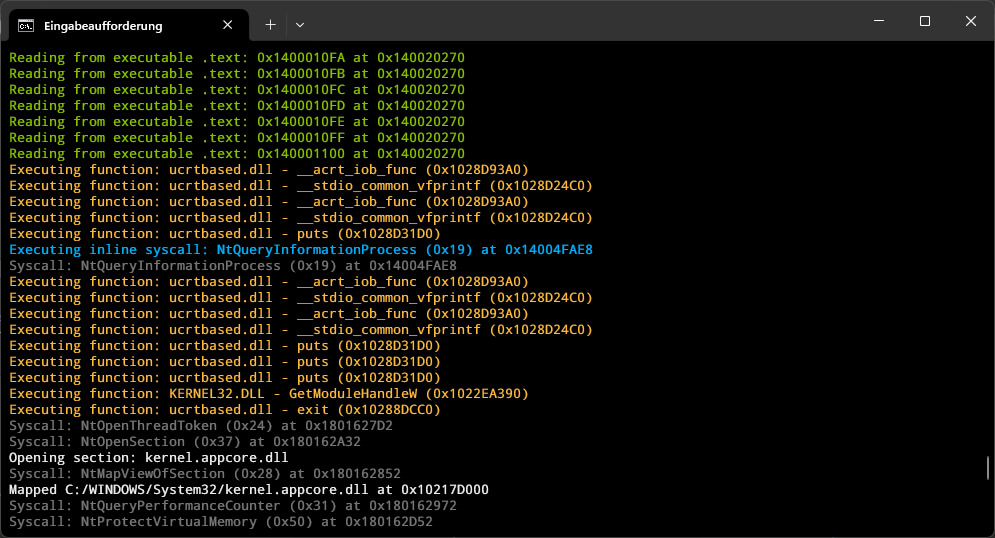
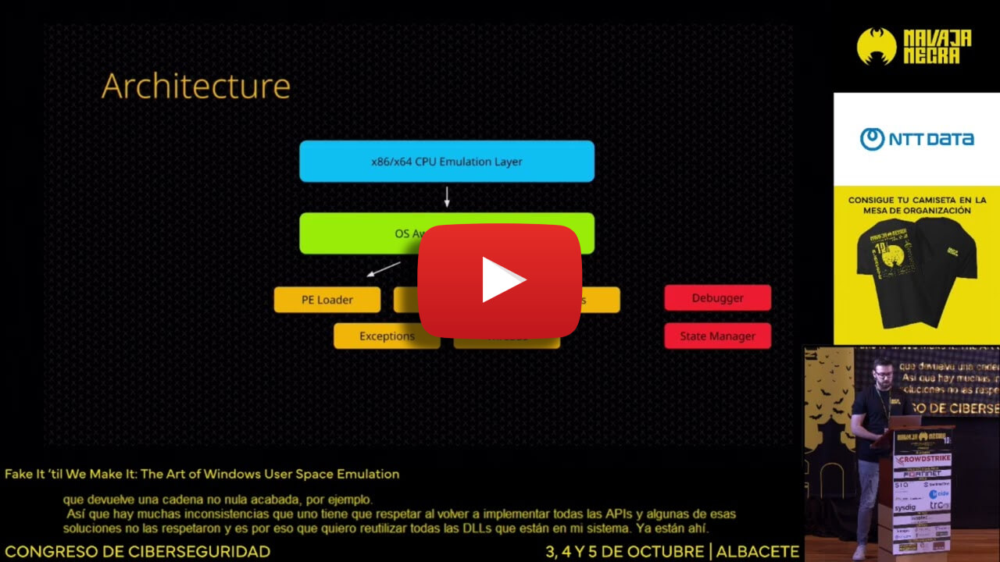

<h1 align="center">
	Windows User-Space Emulator
</h1>

	
	
	
	

The project is still in a very early, prototypy state.
However, constant progress is being made :)

## YouTube Overview

Click <a href="https://docs.google.com/presentation/d/1pha4tFfDMpVzJ_ehJJ21SA_HAWkufQBVYQvh1IFhVls/edit">here</a> for the slides.

## License

Commercial use of this project is not permitted without prior authorization.  
Please contact me for inquiries about obtaining a commercial license.
